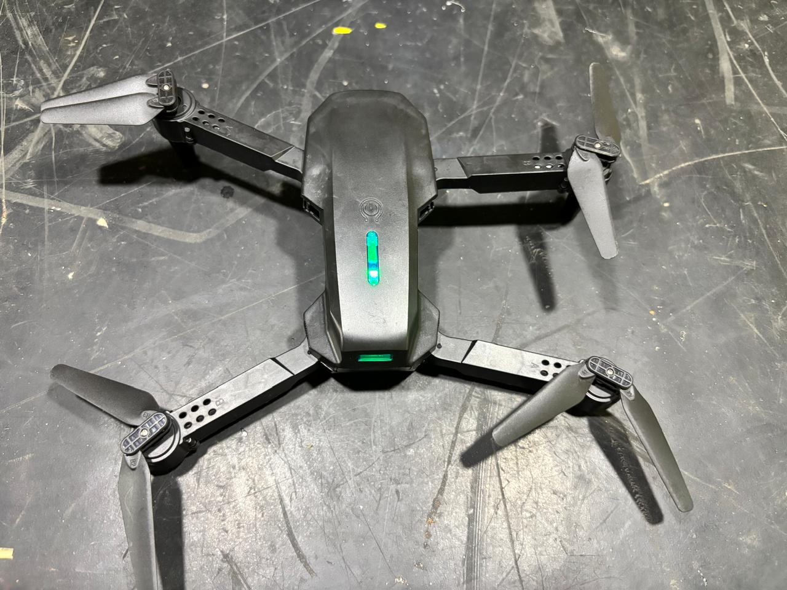
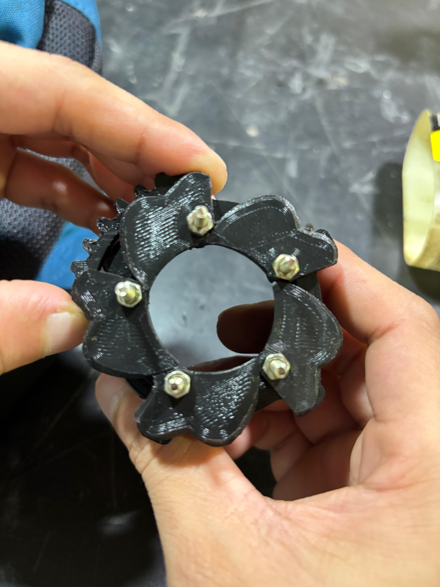
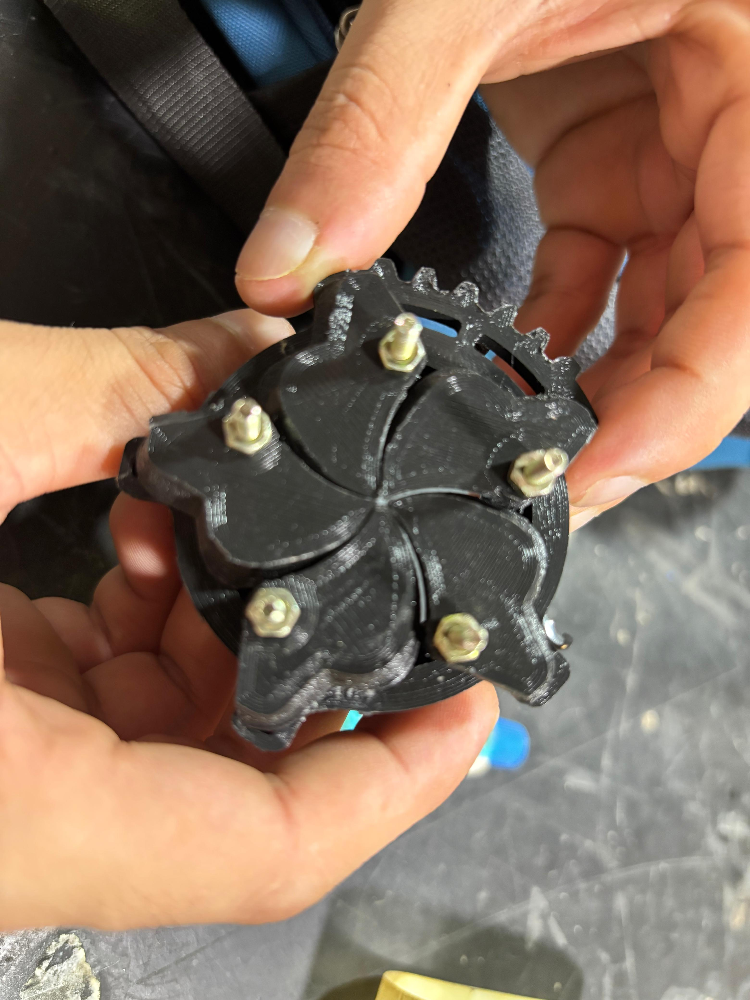

# Seed Dropping Using Drone (AI and IoT Integration)
This project demonstrates a fully functional seed-dropping drone system using AI and IoT technologies. The system utilizes a camera-equipped drone to identify suitable seed-dropping locations and avoid inappropriate areas such as water bodies, obstacles, or unsuitable landforms.

|  |  | 
|-----------------------------------------------------------|-------------------------------------------------------------------|------------------------------------------------------------------|

## 🔍 **Project Overview**

The primary objective of this project is to develop an autonomous drone system capable of analyzing terrains, identifying suitable areas for seed placement, and efficiently performing seed-dropping using machine learning models.

This system leverages:

- **AI Models** trained to classify areas based on images.
- **IoT Integration** for real-time image capture and communication.
- A **custom-built seed-dropping mechanism** integrated with the drone.

---

## 📑 **Features**

- **Image-based Terrain Classification:** Uses a trained machine learning model to distinguish between suitable and unsuitable locations.
- **Autonomous Seed Dropping:** Drones automatically drop seeds based on classification results.
- **Obstacle Avoidance:** Avoids obstacles such as trees, rocks, or water bodies during flight.
- **IoT Real-time Feedback:** Continuously transmits data to a monitoring system for performance and location tracking.

---

## 🎯 **Objectives**

1. Automate seed-dropping to increase agricultural efficiency.
2. Utilize AI to detect and classify proper seed-planting areas.
3. Integrate IoT technology for real-time image transmission and data logging.
4. Ensure environmental sustainability by avoiding seed waste in non-plantable areas.

---

## 📷 **Drone Mechanism and Design**

### 1. **Drone Body**
The drone is designed with lightweight materials for enhanced mobility and battery efficiency.

  

### 2. **Seed Dropping Mechanism**
A custom 3D-printed attachment (shown below) is used for seed dropping. It is integrated with a motor to release seeds when commanded by the AI model’s decision.

  

### 3. **Camera and Sensors**
The drone is equipped with a high-resolution camera and obstacle-detection sensors for real-time environment monitoring.

---

## 🧠 **AI Model Details**

- **Model Architecture:** The image classification model is a CNN (Convolutional Neural Network) trained on labeled images of terrains.
- **Training Data:** The dataset consists of images representing plantable and non-plantable areas (e.g., water bodies, rocks, obstacles).
- **Training Accuracy:** Achieved high accuracy in distinguishing between plantable and non-plantable areas.
- **Deployment:** The trained model is deployed on the drone, enabling it to make real-time decisions during flight.

---

## 🔗 **Code Structure**
├── /model_training # Training scripts and data preprocessing ├── /drone_controller # Code to control drone movement and seed dropping ├── /iot_integration # IoT components for real-time communication ├── requirements.txt # Python dependencies └── README.md # Project documentation

#Current Achievements:
Fully functional terrain classification model with high accuracy.
Smooth integration of AI and IoT for autonomous seed-dropping.

###Future Plans:
Improve obstacle detection with LIDAR integration.
Enhance battery efficiency for longer drone operation.
Develop a user interface for remote monitoring and manual overrides.

